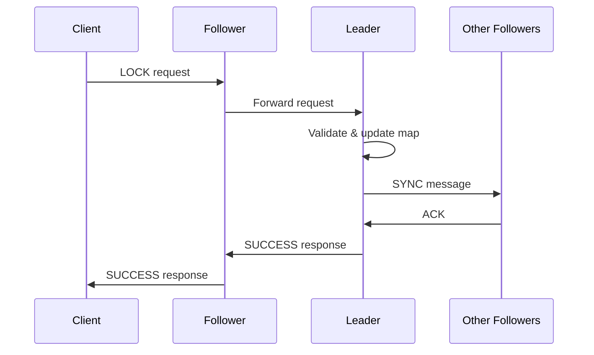

# 🔒 Système de Verrous Distribués avec Consensus

Un système de consensus distribué implémentant un mécanisme de verrous distribués avec un serveur leader et plusieurs serveurs followers, garantissant la cohérence des données à travers la réplication.

## 📋 Table des matières

- [Vue d'ensemble](#vue-densemble)
- [Architecture](#architecture)
- [Fonctionnalités](#fonctionnalités)
- [Installation](#installation)
- [Configuration](#configuration)
- [Utilisation](#utilisation)
- [Tests](#tests)
- [Architecture technique](#architecture-technique)
- [Protocole de communication](#protocole-de-communication)
- [Dépannage](#dépannage)
- [Contributions](#contributions)

## 🎯 Vue d'ensemble

Ce projet implémente un système de consensus distribué qui permet à plusieurs clients de gérer des verrous distribués de manière cohérente. Le système garantit qu'un seul client peut posséder un verrou à la fois, même dans un environnement distribué.

### Caractéristiques principales

- ✅ **Architecture Leader-Follower** avec réplication automatique
- ✅ **Cohérence forte** des données entre tous les serveurs
- ✅ **Protocole de synchronisation robuste** avec ACK et timeouts
- ✅ **Gestion d'erreurs avancée** avec logs détaillés
- ✅ **Monitoring en temps réel** du statut des serveurs
- ✅ **Communication Socket** pour la connectivité réseau

## 🏗️ Architecture

```
┌─────────────────┐    ┌─────────────────┐    ┌─────────────────┐
│   VM Leader     │    │  VM Follower 1  │    │  VM Follower 2  │
│  10.0.2.3:5000  │    │  10.0.2.4:5000  │    │  10.0.2.5:5000  │
└─────────────────┘    └─────────────────┘    └─────────────────┘
         │                       │                       │
         │                       │                       │
         └───────────────────────┼───────────────────────┘
                                 │
                    ┌─────────────────┐
                    │     Clients     │
                    │  (Multiples)    │
                    └─────────────────┘
```

### Composants

- **Leader Server** : Gère toutes les opérations de verrous et synchronise avec les followers
- **Follower Servers** : Répliquent la map du leader et peuvent répondre aux requêtes de lecture
- **Clients** : Se connectent à n'importe quel serveur pour effectuer des opérations

## 🚀 Fonctionnalités

### Opérations supportées

| Opération | Description | Serveur |
|-----------|-------------|---------|
| `LOCK` | Acquérir un verrou distribué | Leader uniquement |
| `UNLOCK` | Libérer un verrou distribué | Leader uniquement |
| `OWN` | Vérifier le propriétaire d'un verrou | Tous les serveurs |

### Règles de fonctionnement

- **LOCK** : Succès si le verrou n'existe pas, échec sinon
- **UNLOCK** : Succès si le client possède le verrou, échec sinon
- **OWN** : Retourne l'ID du client propriétaire ou "NONE"

## 📦 Installation

### Prérequis

- Java 8 ou supérieur
- 3 machines virtuelles Ubuntu (ou machines physiques)
- Connectivité réseau entre les machines

### Étapes d'installation

1. **Cloner le projet**
   ```bash
   git clone <repository-url>
   cd distributed-lock-project
   ```

2. **Compiler les fichiers Java**
   ```bash
   javac Server.java
   javac Client.java
   javac DistributedLockTest.java
   ```

3. **Configurer le firewall** (sur chaque VM)
   ```bash
   sudo ufw allow 5000
   ```

## ⚙️ Configuration

### Configuration réseau

Le système est configuré pour fonctionner avec les adresses IP suivantes :

| Serveur | Adresse IP | Port | Rôle |
|---------|------------|------|------|
| Leader | 10.0.2.3 | 5000 | Serveur principal |
| Follower 1 | 10.0.2.4 | 5000 | Serveur répliqué |
| Follower 2 | 10.0.2.5 | 5000 | Serveur répliqué |

### Modification de la configuration

Pour changer les adresses IP, modifiez le fichier `Server.java` :

```java
private static final Map<String, Integer> SERVER_PORTS = new HashMap<>();
static {
    SERVER_PORTS.put("10.0.2.3", 5000);   // Leader VM
    SERVER_PORTS.put("10.0.2.4", 5000);   // Follower VM 1
    SERVER_PORTS.put("10.0.2.5", 5000);   // Follower VM 2
}
```

## 🎮 Utilisation

### Démarrage des serveurs

**⚠️ Important : Démarrer dans l'ordre suivant**

1. **Démarrer le Leader** (VM 10.0.2.3)
   ```bash
   java Server 10.0.2.3 5000 leader
   ```

2. **Attendre 5 secondes, puis démarrer Follower 1** (VM 10.0.2.4)
   ```bash
   java Server 10.0.2.4 5000 follower
   ```

3. **Attendre 5 secondes, puis démarrer Follower 2** (VM 10.0.2.5)
   ```bash
   java Server 10.0.2.5 5000 follower
   ```

### Utilisation des clients

**Test simple :**
```bash
java Client <server_ip> <port> <client_id>
```

**Exemples :**
```bash
# Se connecter au leader
java Client 10.0.2.3 5000 Client1

# Se connecter à un follower
java Client 10.0.2.4 5000 Client2
```

## 🧪 Tests

### Test automatisé

```bash
java DistributedLockTest
```

Ce test effectue :
- Acquisition de verrous concurrents
- Vérification de la cohérence
- Tests de libération de verrous
- Simulation d'accès concurrent

### Test manuel

```bash
# Test séquentiel
java Client 10.0.2.3 5000 Client1

# Test concurrent (dans un autre terminal)
java Client 10.0.2.4 5000 Client2
```

### Résultats attendus

```
=== Testing Lock Sequence for lock1 ===
Client Client1 - Owner of lock1: NONE
Client Client1 - TryLock(lock1) Response: SUCCESS
Client Client1 - Owner of lock1: Client1
Client Client1 - TryLock(lock1) Response: FAIL
Client Client1 - TryUnlock(lock1) Response: SUCCESS
Client Client1 - Owner of lock1: NONE
=== End of Test Sequence ===
```

## 🔧 Architecture technique

### Flux de données



### Gestion des threads

- **Thread Pool** : Utilisation d'`ExecutorService` pour gérer les connexions
- **Thread Safety** : Synchronisation avec `synchronized` sur les opérations critiques
- **Timeout** : Gestion des timeouts pour éviter les blocages

## 📡 Protocole de communication

### Messages client-serveur

| Message | Format | Description |
|---------|--------|-------------|
| LOCK | `LOCK,<lockName>,<clientId>` | Demande d'acquisition |
| UNLOCK | `UNLOCK,<lockName>,<clientId>` | Demande de libération |
| OWN | `OWN,<lockName>,<clientId>` | Demande de propriétaire |

### Messages inter-serveurs

| Message | Format | Description |
|---------|--------|-------------|
| SYNC | `SYNC,<command>,<lockName>,<clientId>` | Synchronisation |
| REGISTER | `REGISTER,<serverIp>:<port>` | Enregistrement follower |
| ACK | `ACK` | Accusé de réception |

### Réponses

| Réponse | Description |
|---------|-------------|
| `SUCCESS` | Opération réussie |
| `FAIL` | Opération échouée |
| `NONE` | Aucun propriétaire |
| `ERROR` | Erreur système |
| `TIMEOUT` | Timeout réseau |

## 🚨 Dépannage

### Problèmes courants

| Erreur | Cause | Solution |
|--------|-------|----------|
| `Connection refused` | Serveur non démarré | Vérifier que les serveurs sont lancés |
| `Port already in use` | Port occupé | `sudo lsof -i :5000` puis `sudo kill -9 <PID>` |
| `Timeout` | Problème réseau | Vérifier la connectivité entre VMs |
| `Registration failed` | Leader non démarré | Démarrer le leader avant les followers |

### Commandes de diagnostic

```bash
# Vérifier les ports utilisés
sudo lsof -i :5000

# Tester la connectivité
ping 10.0.2.3
telnet 10.0.2.3 5000

# Vérifier les logs
tail -f server.log
```

### Logs et monitoring

Le système affiche des logs détaillés avec :
- 🔗 Connexions entrantes
- 📨 Messages reçus/envoyés
- 🔄 Opérations de synchronisation
- ⚠️ Erreurs et timeouts
- 📊 Statut des serveurs

## 📊 Performance

### Métriques

- **Latence** : ~10-50ms pour les opérations locales
- **Throughput** : ~100-500 opérations/seconde
- **Cohérence** : 100% (cohérence forte garantie)

### Optimisations

- **Thread Pool** : Gestion efficace des connexions
- **Timeout** : Évite les blocages
- **Logs asynchrones** : Pas d'impact sur les performances

## 🔒 Sécurité

### Considérations

- **Authentification** : Non implémentée (ajout possible)
- **Chiffrement** : Communication en clair (TLS possible)
- **Autorisation** : Contrôle d'accès basique par client ID

### Recommandations

- Utiliser TLS pour la communication
- Implémenter l'authentification des clients
- Ajouter des logs d'audit

## 🤝 Contributions

### Comment contribuer

1. Fork le projet
2. Créer une branche feature (`git checkout -b feature/AmazingFeature`)
3. Commit les changements (`git commit -m 'Add some AmazingFeature'`)
4. Push vers la branche (`git push origin feature/AmazingFeature`)
5. Ouvrir une Pull Request

### Standards de code

- Respecter les conventions Java
- Ajouter des commentaires pour les fonctions complexes
- Tester les modifications
- Mettre à jour la documentation

## 📄 Licence

Ce projet est sous licence MIT. Voir le fichier `LICENSE` pour plus de détails.

## 👥 Auteurs

- **Alexandra** - Développement initial
- **Équipe ICT3** - Tests et validation

## 📞 Support

Pour toute question ou problème :
- Ouvrir une issue sur GitHub
- Contacter l'équipe de développement
- Consulter la documentation technique

---

**🎉 Merci d'utiliser notre système de verrous distribués !**